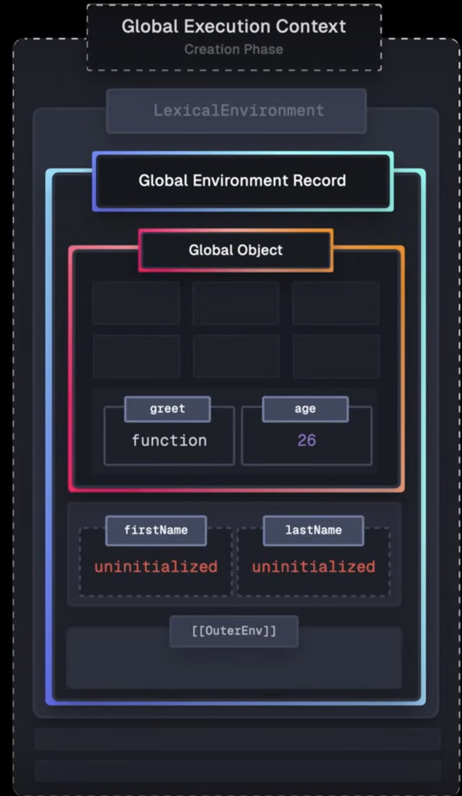

## Variable

**Value** is the smallest unit we have in a javascript
we can use it over and over again in a variable by storing in a variable

> variable is like a box

- You can start variable with a dollar sign.
- we should not start variable with uppercase letter
  it is a convention.
- if a real constant than name variable in uppercase

```javascript
let PI = 3.14;
```

## Datatypes

Every value in javascript is either an object or a primitive
There are seven primitive datatypes in javascript
value taken by a variable that is not yet defined - Undefined

```Javascript
let children;
```

### Javascript is dynamic typing

when you create a variable in javascript you don't need to
define its datatype. this is called dynamic typing.

### Mutating a Variable

```javascript
let age = 30;
// mutating a variable
age = 31;
```

### let, var and const in Javascript

`let` is block scoped and `var` is function scoped.
You should never use `var`
If we dont use let or const or var while declaring a variable, javascript will not show any error. Instead, It will create property on global object.

## Type Conversion and Coercion

Type conversion is when we manually convert from one type to another while type coercion is when javascript automatically converts behind the scene for us.

### Type Conversion

Let's see Type Conversion in action using a code that calculate age

```javascript
const myBirthYear = "1991";
const now = 2025;
const myAge = now - Number(myBirthYear);
console.log(`My age is ${myAge}`); // My age is 34
```

### Type Coercion

When we input two different datatypes values then javascript converts one of the value to the same type as the other one to match the type. In this example when we do `+` operation on a string and a number, first it converts number into string and then do the operation and the end result is a string. Let's take an example below

```javascript
const inputYear = "1991"; // '1991' here is a string
console.log(inputYear + 10); // '199110'
console.log(typeof inputYear); // string
```

`console.log(inputYear + 10) ` is same as `console.log(inputYear + '10')` both gives the same output `'199110'` the only difference is that in the former code example javascript is doing type coercion on its own behind the scene.

If we perform `-` `*` `/` operation on a string and a number then javascript converts the string to a number then perform the operation. Let's take a look at the code below

```javascript
const myBirthYear = "1991"; // '1991' is a string
const now = 2025; // 2025 is a number
const myAge = now - myBirthYear; // '1991' => 1991
console.log(`My age is ${myAge}`); // My age is 34
// Multiplication on string numbers
console.log("23" * "3"); // 69
// Division on string numbers
console.log("23" / "4"); // 5.75
```

Type conversion of a string that has no numeric value gives NaN

```javascript
console.log(Number("Priyavrat")); // NaN - Not a number
```

NaN is a number but not a valid number.

```javascript
console.log(typeof NaN); // Number
```

## Strict Equality Operator `===`

This operator does not do type coercion behind the scene.

```Javascript
console.log(18 === '18'); // false
console.log(18 === 18); //true
```

## Functions

It is a piece of code that we can use over and over again. It is little bit like variable but whole chunk of code.

**Note:** _Variable_ can hold a value but _Function_ can hold lines of code

```javascript
// defining the function
function logger() {
  // function body
  console.log("My name is Priyavrat");
}
// calling / invoking / running the function
logger();
```

### Parameters

Parameters are like variables that are specific only to that function. In this example _oranges_ and _apples_ are the parameters of the function `fruitProcessor()`

```javascript
function fruitProcessor(apples, oranges) {
  console.log(apples, oranges);
  const juice = `Juice with ${apples} apples and ${oranges} oranges.`;
  return juice;
}
```

## Short-circuiting in OR Operator

In the case of an OR Operator short-circuiting means if the first value is a truthy value, it will immediately return that first value. In the example below since `3` is a truthy value so it is returned immediately.

```javascript
console.log(3 || "Jonas"); // 3
```

If the first value is truthy value then javascript doesn't even look at the remaining values.
If the first value is the falsy then it looks at the next value and so on until either it reaches the last value or it encounters the first truthy value. If there is no truthy value in the circuit then it returns the last value even if it is a falsy value.

```javascript
console.log("" || null || undefined); // undefined
```

In the above code, since all the value in the circuit are falsy, it returns the last value, which is, `undefined`

```javascript
console.log("" || null || undefined || 23 || false); // 23
```

In the above code, this it returns the first truthy value it encountered and short-circuiting the rest of the evaluation.

### Use Case

Let's say there is a property called `numGuest` on the `restaurant` object but we don't know if it exists, however we want define a number of guests variable based on this property. then we can use OR operator to set that variable a default value in case `restaurant.numGuest` property doesn't exist.

```javascript
restaurant1 = {
  name: "Shiv Dhaba",
  owner: "Parminder Singh",
};
const guests = restaurant1.numGuest || 10;
// otherwise we would achieve the same result using ternary operator
const guests1 = restaurant1.numGuest ? restaurant1.numGuest : 10;
```

If `restaurant2.numGuest` exists, then the default value will be ignored.

```javascript
restaurant2 = {
  name: "Green Valley",
  numGuest: 23,
};
const guests2 = restaurant2.numGuest || 10; // 23
```

## Nullish coalescing operator

Suppose there is another object that has `restaurant3.numGuest` property is equal to zero. In that case since zero is a falsy value
it won't short-circuit the evaluation and it returns the default value. So how to deal with that problem? We use Nullish coalescing operator `??` instead. This operator only short-circuit when either there is null or undefined value. All other values are truthy value for that operator.

```javascript
restaurant3 = {
  name: "Doab Vilas",
  numGuest: 0,
};
const guest4 = restaurant3.numGuest || 10; // 10
// how to fix this?
const guest5 = restaurant3.numGuest ?? 10; // 0
```

### Short-circuiting in AND Operator

And operator work the opposite way as the OR operator work. In And operator, as soon as it encounters the first falsy value it immediately short-circuit the rest of the evaluation and returns the first falsy value it encountered.

## Execution Context

Execution context defines the Environment in which our code is executed. It contains many internal components that our engine uses to keep track of execution flow off that piece of code. See the **figure 1**

_Figure 1_

Execution context uses _Environment Record_ to keep track and maintain the identifier bindings that have been created for the variable declarations and function declaration or for all the values within that context. See the **figure 2** below.

_Figure 2_

```javascript
const firstName = "Lydia";
const lastName = "Hallie";
function greet(nameToGreet) {
  const fullName = firstName + " " + lastName;
  return "Hello, " + fullName;
}
greet(firstName);
```

First when the script is loaded, the global execution context is created. You can see the _Global Execution Context_ in the **figure 3**. Every Execution Context goes through 2 phases - Creation Phase and Execution Phase. In the creation phase, memory space is created for the variable declarations and the function declarations along within that context. Then we have the execution Phase, in which the execution context is on the call stack and the code is actually executed.

_Figure 3_

An Execution Context has many components but for now i just want to focus on the realm, lexical Environment and the Variable Environment.

## Realm

So Realm points to a realm record and realm is essentially an isolated Environment in which our code runs. So for example in the browser the new realm is created whenever we open a new tab or we refresh a page, service workers, iframes etc. A realm consist of several components including the Intrinsics, Global Object and the Global Environment Record. It provides all the standard built-in objects and functions that are just foundational for executing scrips for arrays, functions, syntax errors and so on.

### Global Object

Global Objects which contains several types of properties - **Spec Properties**, **Host Properties** and **User Properties**. We can set user properties implicitly or explicitly. We happen to set user properties on global object implicitly whenever we declare either a function on the global space or variables using the `var` keyword also on the global scope.

### Global Environment Record

Global Environment Record manages the identifier bindings within that context and in the case of Global Environment Record these values are accessible throughout the entire script.

#### Object Record

It also has ObjectRecord which points to the Global Object in case of Global Execution Context. In other ObjectRecord is just a direct reference to the Global Object. So ObjectRecord is used by the variable declared with the `var` keyword and by the functions declaration on the global scope.

#### Declarative Record

It stores all identifiers bindings that aren't variable with `var` keyword or functions declarations, so everything except for those two.

#### Global this keyword

It also contains the this keyword which in the case of global environment record, it points to the global object.

#### Outer Environment Property

It is a property of the Function/Global Environment record. In the case of global Environment it is null but in other cases it points to the Environment Record it is created in.

## Lexical Environment

It points to the Environment record that contains the binding to everything except for the variables declared with the `var` keyword. So in this case it the Global Environment Record

## Variable Environment

This points to the Environment records that store the bindings for the variable declared using `var` keyword which is in this case is the Global Environment Record.

## Creation Phase

So when it parse the code it encounters the variable `firstName` which is declared with the const keyword so it uses the Lexical Environment of the Execution Context and this in turns points to _Global Environment Record_ and this again uses the _declarative record_ to handle the identifier bindings created using the const keywords. Variables declared using const or let are un-initialized and memory is set up, they are hoisted but they don't have a value yet. They are only initialized during the Execution Phase of the Execution Context. Same happens in the case of variable `lastName`. See the **figure 4**.


Now we comes to the line where function greet() is declared. Function declarations are managed by the _ObjectRecord_ and in contrast to the two previous variables, Functions are initialized during the Creation Phase, so a new _Function Object_ (see the **figure 5**) is created for the function greet. It contains many properties, two of which are the **Environment** which points to the Environment Record in which the function was declared so in this case it is the _Global Environment Record_ and second is **Call** which is a method and is called whenever we invoke the function.


## Execution Phase

Global Execution Context is added to the call stack. So first line in the code is firstName which contains the value `Lydia` and it gets initialized with that value to the firstName variable same happens in the second line to the lastName variable. See the **figure 6**.


Then we come to the greet() function and it already initialized in the memory so nothing happens. Then in the next line 9, we invoke that function so the call() on the Function Object is called (see the **figure 7**) and this in turn creates a new _Function Execution Context_.


## Creation Phase of the Function Execution Context

In this case the Lexical Environment contains the brand new _Function Environment Record_.

## Lexical Environment for the Function Execution Context

It contains the Function Environment record.

### Function Environment Record

It manages all the bindings for the parameters, variables declarations and the function declarations within this function. It also has an Outer Environment property.

#### Outer Environment for the function Environment Record

It points to the _Environment_ of the _Function Object_ which is containing the _Global Environment Record_. See the **figure 8**.


Unlike the Global Execution Context we have to deal with the function parameters. In our code the parameter is `nameToGreet` which is immediately initialized unlike the variables declared using _let_ or _const_ keywords. so the parameter is initialized with `Lydia` in this case.

So next is the declaration of the new variable `fullName` using the _const_ keyword. so it is added to the **Function Environment Record** but un-initialized.

## Execution Phase for the Function Execution Context

So function execution context is added to the call stack. So in the first line of the greet function, we have the `fullName` variable. This variable uses both the `greetToName` parameter variable and also the `lastName` variable but _Function Environment Record_ itself doesn't have binding for the `lastName` variable so instead it uses the _Outer Env_ property of the _Function Environment Record_ to search through the chain of Environments (scope chain) to see if the outer environment does have the binding for this variable. So in this case global Environment Record does have the binding for the `lastName` variable so now `fullName` is now initialized with 'Lydia Hallie'. Then the function returns the 'hello Lydia Hallie' as then the Function Execution Context is popped out of the call stack.

### Side note

Variable declared using the `var` keyword are initialized with the _undefined_ during the Creation Phase. That variable resides inside the Global Object if it is declared in the global scope as oppose to Variable declared using let and const keyword which resides inside the _Declarative Record_ of the Global Environment Record.

The scope chain refers to mechanism made available through the _Outer Env_ property of the Environment Record\_ so whenever we try to access a property that is not inside the current context environment record the engine will traverse the chain of environments of the scope chain until it finds the binding.
